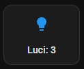
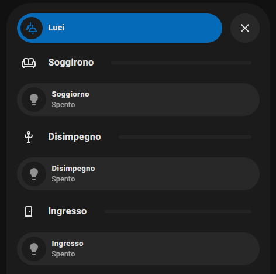

## Bottone Luci
## Bottone con conteggio delle luci accese e pop-up interattivo per la gestione delle luci

## Bottone


## PopUp


## Descrizione
Questa configurazione permette di monitorare il numero di luci accese in Home Assistant.  
Cliccando sul bottone è possibile:
- accendere e spegnere le luci
- modificare l’intensità luminosa
- cambiare il colore (se supportato)

## Dipendenze
Per utilizzare questo codice sono necessari:
- Home Assistant aggiornato
- Luci compatibili con Home Assistant
- Mushroom Card (installabile tramite HACS)  
  https://github.com/piitaya/lovelace-mushroom
- Bubble Card (installabile tramite HACS)  
  https://github.com/Clooos/Bubble-Card

## Importante
La parte di codice del bottone:

```yaml
tap_action:
  action: navigate
  navigation_path: "#Light-total"

```yaml
card_type: pop-up
hash: "#Light-total"

## ESEMPIO
""#Light-total"

Se i valori non coincidono, il pop-up non verrà aperto.

## Note

Configurazione mostrata nel video TikTok.
Adattare entity_id e nomi delle luci in base al proprio sistema.

## Hardware Utilizzato

Relè Zigbee Sonoff ZBMini Extreme (no neutro)
👉 https://amzn.to/4pIKrLP

Lampada Govee da terra con base luminosa
👉 https://amzn.to/4qiRsnL

Lampada Govee da terra
👉 https://amzn.to/4aZ16HB

Govee COB Striscia LED Pro 3m
👉 https://amzn.to/3NLMUry

Aqara Striscia LED T1 con Matter
👉 https://amzn.to/4qRkN8C

## Affiliazione

I link Amazon presenti sono link affiliati.
Acquistando tramite questi link supporti il canale senza costi aggiuntivi.
